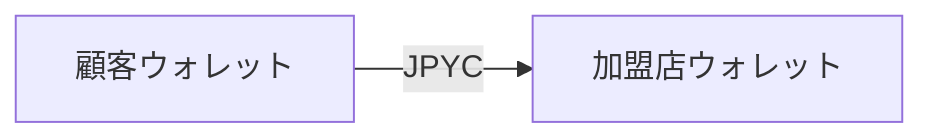

# ライティングガイド

このリポジトリのドキュメントを書くときの表記と文体をまとめています。README、CONTRIBUTING、
コード内のコメントに適用します。文体の節は日本語の文書だけに適用します。それ以外の節は英語の
文書にも適用します。

## 文体

操作説明はです・ます調で統一します。だ・である調と混在させません。

コマンドを実行したあとに起きることは、平叙文で事実だけを書きます。

```
悪い: これだけで動く。ブラウザで http://localhost:7826 が開くので、そこから Payment を作る。
良い: Console は http://localhost:7826 で起動します。ここで最初の Payment を作成します。
```

悪い例では、だ・である調に会話体が混ざり、「〜ので、そこから」という口語の接続でつなぎ、
読者の動作まで描写しています。

依頼は「〜してください」と書きます。体言止め（「〜を参照。」）は表とリストの中だけで使います。

## 不要な文

節の終わりに格言を置かないでください。

```
悪い: 復旧は設計要件であって、運用の後付けではありません。
```

前の文で照合の仕組みを説明していれば、この一文は何も足していません。

方針や手順を述べたあとに、その理由を書き足さないでください。

```
悪い: 図は Mermaid で書きます。GitHub が描画し、あとから編集できます。
良い: 図は Mermaid で書きます。
```

仕組みを説明する文書では理由が本体になります。この項目は、方針や手順を述べる文書にだけ
適用します。

読者が行動に使わない文も削ります。次のような文を、読者は使いません。

- 設計の良し悪しについての自己評価
- なぜその節を書いたかの説明
- 代償を引き受けるという表明

セットアップの重さ、開発環境の前提、貢献の心構えは README に書きません。該当するドキュメントへの
1行のリンクで足ります。

## 主体

モノに人間の動詞をさせないでください。誰が何をするかを書きます。

```
悪い: Console が最初の Payment まで案内します。
良い: Console は http://localhost:7826 で起動します。
```

受動態で主体を隠さないでください。

```
悪い: 期限切れの Payment は expired に更新されます。
良い: 期限切れワーカーが Payment を expired にします。
```

一文の途中で主語を変えないでください。

```
悪い: GitHub が描画し、あとから編集できます。
良い: GitHub が描画します。書き手はあとから編集できます。
```

## 対比

「A ではなく B」を並べないでください。B を直接書きます。

```
悪い: Reconciliation は監視ではなく修復のための仕組みです。
良い: Reconciliation は内部状態とチェーンの差異を修復します。
```

対比そのものが情報になっている箇所では使えます。1つの文書に3回以上出てくる場合は、必要な1つを
残して他を書き換えてください。

## 記号

挿入のダッシュ（—）を使わないでください。読点、コロン、カッコのいずれかにします。

中黒による3項目以上の並列（A・B・C）は「と」「や」に置き換えます。2項目は中黒でも読めますが、
文書内で揃えてください。

## 図

図は Mermaid で書きます。ASCII アートは使いません。

````

````

`text` フェンスはリスト（環境変数、イベント名、フィールド一覧）とディレクトリツリーに限ります。

## 見出し

見出しは名詞句にします。

```
悪い: ## Payment がこのシステムの中心である
良い: ## Payment モデル
```

## 用語

英語のまま書くのは、コードに現れる識別子だけです。

```
Payment、Finality、Webhook、Console、Chain Adapter → 英語のまま
```

概念を指すだけの英語は日本語にします。

```
blast radius → 障害範囲
confirmation policy → 確定判定
transfer intent → 送金指示
throughput → 処理量
```

略語は初出で展開します。

```
悪い: MPC プロバイダと連携できます。
良い: MPC（複数当事者計算）プロバイダと連携できます。
```

製品名は `suco Pay` と書きます。リポジトリ、パッケージ、コマンドは `sucopay` と `suco` です。

## 未完成のもの

書く予定の項目を並べた見出し（`## Outline`）や `TBD` を残さないでください。

決まっている事実だけで短く書くか、そのファイルを作らないかのどちらかにします。

## 公開しないもの

このリポジトリは公開されます。次の内容は書きません。

- 事業上のターゲット区分
- 未公表の数値目標
- 内部資料の所在

## 編集後の確認

文書を書き換えたら、削った内容を指していた指示語が残っていないか確認します。

```
変更前: Docker が必要です。Console は…
変更後: 他に必要なものはありません。Console は…
```

「他に」が何に対する「他に」なのか、削除によって失われています。この種の欠陥は文を単体で
読んでも見つかりません。`他の` `その` `これ` `also` `other` `that` で検索し、指示対象が同じ
文書内にあるかを1つずつ確認してください。
