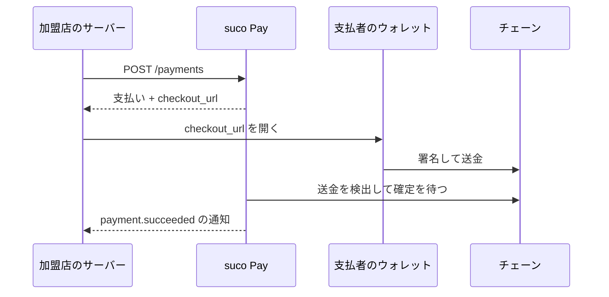

# 開発者向けドキュメント

English: [README.md](README.md)

suco Pay を評価し、決済の組み込みを準備するための入口です。まだサーバーを起動していない場合は、
[リポジトリの README](../README.ja.md#はじめかた) から始めてください。

> **重要:** suco Pay は開発初期です。支払いの作成と追跡はできますが、Checkout とウォレットを
> 接続するブラウザー用モジュールは未公開です。支払いフローの確認には `suco payment await` を
> 使います。本番導入を計画する前に [ロードマップ](../ROADMAP.ja.md) を確認してください。

## 最初の組み込み

次の順番で進めます。

1. **suco Pay をローカルで起動します。** [はじめかた](../README.ja.md#はじめかた)に従って
   バイナリをビルドし、`suco.yaml` を初期化して、PostgreSQL に接続します。
2. **ネットワークと資産を接続します。** Polygon Amoy から始め、支払いを受け取るウォレットを
   登録します。[設定](configuration.ja.md#テストネット) と
   [`suco asset accept`](operating.ja.md#suco-asset-accept) を参照してください。
3. **支払いを作ります。** [API](api.ja.md)を参照して認証と冪等性キーを設定し、
   `POST /payments` を呼びます。
4. **支払者を Checkout へ案内します。** 支払いレスポンスの `checkout_url` を使います。
   開発初期の間は、`suco payment await` で支払者が署名する値を取得します。手順と制約は
   [Checkout](checkout.ja.md)を参照してください。
5. **加盟店のサーバーで結果を確定します。** `payment.succeeded` を購読し、同じ通知を
   2 度処理しない受信処理を実装します。[Webhook](webhooks.ja.md)に署名検証と再送への対応を
   まとめています。
6. **返金を組み込みます。** 返金を作り、受取ウォレットで署名して、`refund.succeeded` を
   待ちます。詳しい状態遷移は [返金](refunds.ja.md)を参照してください。
7. **本番運用を準備します。** ヘルスチェック、ネットワーク異常の監視、復旧コマンドを設定します。
   障害時の判断基準と復旧手順は [運用](operating.ja.md)を参照してください。

## 目的から探す

| 目的 | 参照先 |
|---|---|
| 設定項目や既定値を確認する | [設定](configuration.ja.md) |
| 支払いを作成または取得する | [API](api.ja.md) |
| 支払者向けページを組み込む | [Checkout](checkout.ja.md) |
| イベントを検証し、再送を処理する | [Webhook](webhooks.ja.md) |
| 返金を作成して追跡する | [返金](refunds.ja.md) |
| 稼働準備状態を診断し、ワーカーを復旧する | [運用](operating.ja.md) |
| 実装済みの機能を確認する | [ロードマップ](../ROADMAP.ja.md) |

## 支払いの全体像

支払いの確定は `payment.succeeded` で判断してください。送金は確定前にも見えますが、
チェーンの再編成（reorg）で消える可能性があります。
