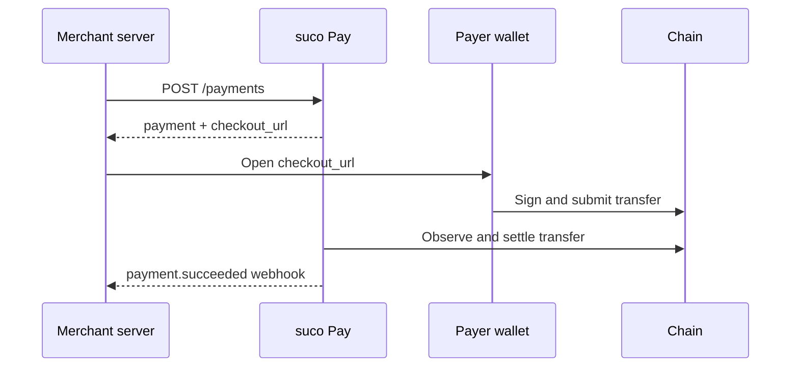

# Developer documentation

日本語: [README.ja.md](README.ja.md)

Use this page to choose the shortest path from evaluating suco Pay to preparing a payment
integration. If you have not started the server yet, begin with the
[repository README](../README.md#getting-started).

> **Pre-alpha:** suco Pay can create and track payments, but the browser module that connects
> Checkout to a wallet has not been released. You can exercise the payment flow with
> `suco payment await`. See the [roadmap](../ROADMAP.md) before planning a production launch.

## First integration

Follow these steps in order:

1. **Run suco Pay locally.** Build the binary, initialize `suco.yaml`, connect PostgreSQL, and
   start the server with the [getting-started guide](../README.md#getting-started).
2. **Connect a network and asset.** Start with Polygon Amoy, then register the wallet that will
   receive payments. See [Configuration](configuration.md#a-testnet) and
   [`suco asset accept`](operating.md#suco-asset-accept).
3. **Create a payment.** Add API authentication, choose an idempotency key, and call
   `POST /payments`. See [API](api.md).
4. **Send the payer to Checkout.** Use the `checkout_url` from the payment response. During
   pre-alpha, use `suco payment await` to obtain the values that the payer signs. See
   [Checkout](checkout.md).
5. **Confirm the outcome on your server.** Subscribe to `payment.succeeded` and make webhook
   processing idempotent. See [Webhooks](webhooks.md).
6. **Add refunds.** Create a refund, sign it with the receiving wallet, and wait for
   `refund.succeeded`. See [Refunds](refunds.md).
7. **Prepare production operations.** Configure health probes, alert on degraded networks, and
   rehearse recovery commands. See [Operations](operating.md).

## Find a reference

| When you need to… | Read |
|---|---|
| Look up a setting or its default | [Configuration](configuration.md) |
| Create or retrieve a payment | [API](api.md) |
| Integrate the payer-facing page | [Checkout](checkout.md) |
| Verify events and handle retries | [Webhooks](webhooks.md) |
| Create and track a refund | [Refunds](refunds.md) |
| Diagnose readiness or recover a worker | [Operations](operating.md) |
| Check what is implemented | [Roadmap](../ROADMAP.md) |

## Core payment flow

Treat `payment.succeeded` as the point at which the payment is final. A transfer may appear
before it settles, and it may disappear in a chain reorganisation.
